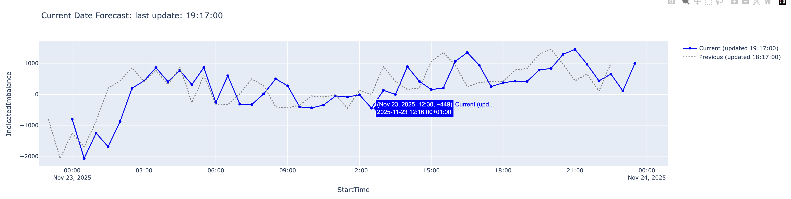

# SET - Home Assignment

This repository contains a minimal application that displays:
- the `Indicated Imbalance` (forecast of the difference between supply and demand) of the electricity market
- the comparison between forecasted and actual solar/wind energy generation in MW

# Installation

Install pipenv if not already installed:

    $ pip install --user pipenv

Install dependencies:

    $ make install

# Running

Run the application locally with:

    $ make run

Then open your browser at `http://127.0.0.1:8050`

# Tests

A suite of unit tests (not exhaustive) can be done via

    $ make tests

# Project Structure

```
seagull/
├── app.py
├── bmrs_elexon.py
├── tests/
│   ├── test_indicatedimbalance.py
│   └── test_windsolarforecastctuals.py 
├── data/
│   ├── indicatedimbalance.csv
│   └── windsolarforecastctuals.csv
├── Pipfile
├── Makefile
└── README.md
```

# Visual Indicator

I've chosen to plot the previous estimation of the `IndicatedImbalance` alongside the graph that displays the current estimation.
Since new forecasts are published every ~30 minutes, you can find below a screenshot showing how it looks when data updates:


<br></br>

The shift between curves is expected. When a new `PublishTime` is published, it updates the current estimations for existing periods and adds a new value for a period that hasn't been estimated yet.

# Comments

### *Wind/Solar Graphs - What impact do you think the forecast error might have had on the system?*

Based on the graphs plotted for the '2025-11-20' date, we can observe two patterns:

- an excess of solar energy generation, whereas the forecast expected less
- a shortage of wind generation, whereas the forecast expected more

Forecast errors directly impact the "energy plan" of companies that produce or buy energy on the market.
The larger the error, the greater the mismatch between expected and actual supply is, which can lead to significant electricity demand fluctuations and price volatility.

### *Notes on the Application*

This Dash application has been developed with the help of some LLM for cleaning, testing and suggesting.

Ways to improve this application could be to:

- Use of pydantic to enforce the data structure just after the api call
- Use of some boostrap to make the front looks prettier
- For production grade, add more extra integration and performance tests.
- Containerize the application for further extension with other services


